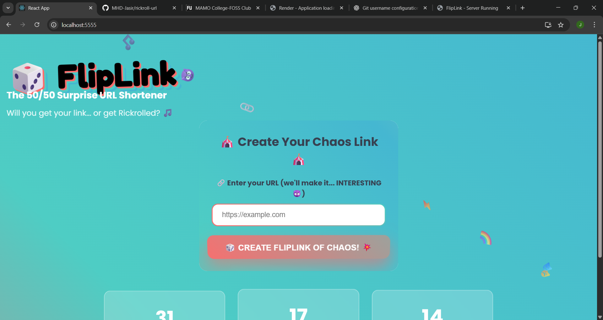
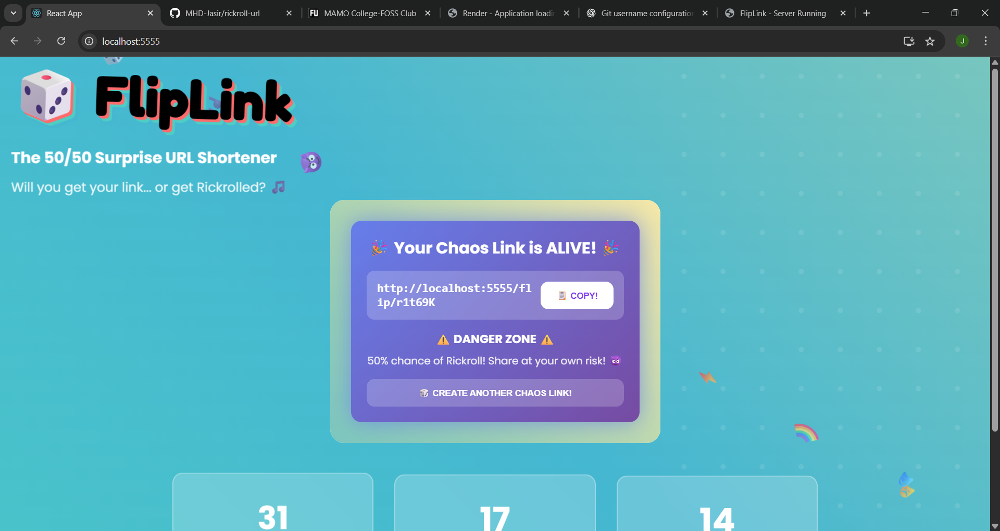
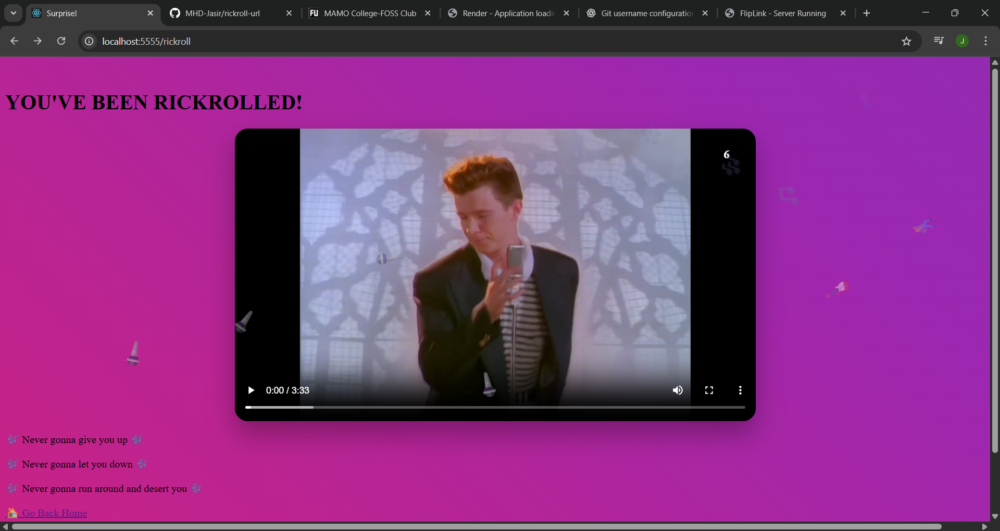
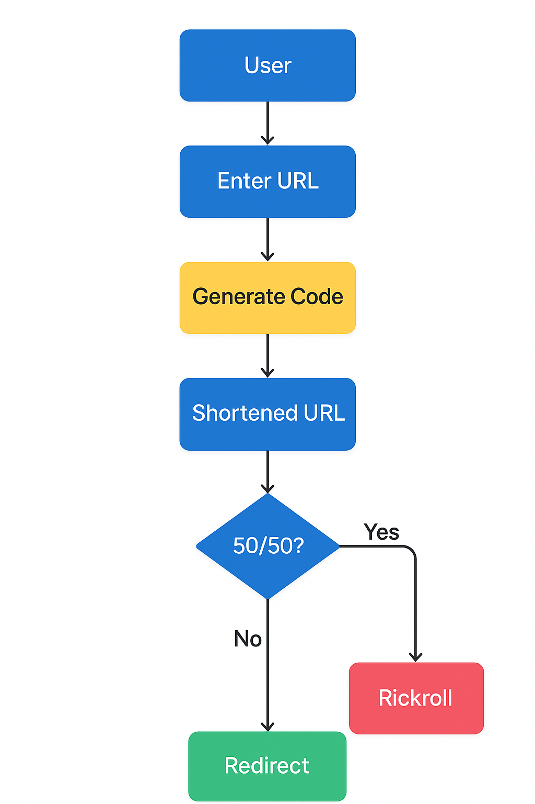

---

# 🎲 FlipLink - The 50/50 Surprise URL Shortener 🎯

## Basic Details

### Team Name: **mulearners**

### Team Members

* **Team Lead**: Akshay K A – MAMO College
* **Member 2**: Muhammed Jasir E – MAMO College

### Project Description

FlipLink is a chaotic URL shortener that gives you a 50/50 chance of reaching your intended website or being Rickrolled. It’s built for fun, randomness, and a healthy dose of internet mischief.

### The Problem (that doesn't exist)

Sometimes clicking a link is too predictable. Where’s the thrill? Where’s the chaos? Life’s too short to always end up where you expect.

### The Solution (that nobody asked for)

A URL shortener that adds suspense to every click. Half the time, you’ll get where you want… and the other half, you’ll be enjoying Rick Astley’s greatest hit.

---

## Technical Details

### Technologies/Components Used

**For Software:**

* **Languages**: JavaScript (Node.js)
* **Frameworks**: Express.js
* **Libraries**: nanoid
* **Tools**: npm

**For Hardware:**

* None — pure software chaos.

---

### Implementation

**For Software:**

#### Installation

```bash
git clone https://github.com/MHD-Jasir/rickroll-url.git
cd rickroll-url
npm install
```

#### Run

```bash
npm start
```

Visit `http://localhost:5555` and start rickrolling! 🎵

---

### Project Documentation

**For Software:**

#### Screenshots


*Main input page where users enter the URL to shorten.*


*View real-time stats of successful redirects and Rickrolls.*


*The unlucky 50%: Rickrolled!*


*The lucky 50%: Redirected to the intended URL.*

#### Diagrams


*Architecture showing how FlipLink decides your fate.*

---

### Project Demo

#### Video

[Demo Video](./screenshot/demovideo.mkv)
*Demonstrates URL creation, 50/50 redirects, and stat tracking.*

---

## Team Contributions

* **Akshay K A**: Backend development, randomization logic, and Express server setup.
* **Muhammed Jasir E**: Project design, documentation, testing, and GitHub management.

---

**Made with ❤️ and chaos at TinkerHub Useless Projects**


---
